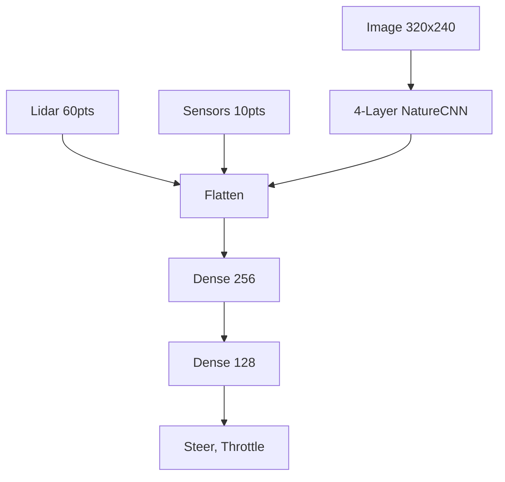

# 🏎️ Monaco Autonomous Racing: Ultimate Engineering Manual (V3)

This is the definitive knowledge base for the Monaco autonomous racing ecosystem. It synthesizes months of development, multi-agent historical data, and critical bug fixes into a unified technical atlas.

---

## 1. 📂 Core Repository Architecture

| Component | Files | Primary Responsibility |
| :--- | :--- | :--- |
| **Robotics & SLAM** | `stare/run_slam_mapping.py`, `stare/calibrate_monaco.py` | Lidar localization & map generation |
| **Path Optimization** | `stare/generate_optimal_path.py` (A* + B-Spline) | Generating the optimal racing line (Apex Line) |
| **Expert Model (BC)** | `train_bc_monaco.py`, `bc_model_weights_monaco.pth` | Supervised learning from expert telemetry |
| **RL Controller (PPO)** | `run_ppo.py`, `gym_donkeycar/wrappers.py` | SB3-based reinforcement learning with weight injection |
| **System Stability** | `gym_donkeycar/envs/donkey_sim.py` | Low-level bridge, Watchdogs, Hang-prevention |

---

## 2. 🗺️ SLAM & Path Planning Mastery

### 2.1 Coordinate System Alignment (The "Mirror" Mystery)
Historical data from previous agents revealed a critical mismatch between Sim Lidar and SLAM.
- **The Bug**: Lidar indices in Unity are CCW, but some SLAM libraries expect CW.
- **The Fix**: `calibrate_monaco.py` introduced `LIDAR_MIRROR = -1` and a `YAW_OFFSET = 45°`. This ensures that when the car sees a wall on the left, the internal map registers it on the left.
- **Anchor Scans**: We use `monaco_slam_anchor.npy`. Upon reset, the agent compares its 0-step scan with this anchor to eliminate "Spawn Rotation Drift."

### 2.2 Apex Planning (A* + Splines)
- **Inflation Strategy**: Walls are "inflated" by 4 pixels (0.2m) using `cv2.erode`. This creates a safe corridor for the A* planner.
- **B-Spline Smoothing**: Pure A* paths are jagged. We use `scipy.interpolate.splprep` with `s=2.0` to generate a 1200-point smooth racing line that allows for high-speed momentum preservation.

---

## 🧠 3. Behavioral Cloning (BC) Architecture

### 3.1 V70 Master Sync Protocol
All sensor data must be normalized for the Neural Network to process it effectively:
- **Speed**: `current_speed / 20.0`
- **Accel/Gyro**: `accel / 10.0`, `gyro / 5.0`
- **Vision**: 320x240 RGB frames, normalized strictly in the first layer of the network.

### 3.2 Network Topology

---

## ⚡ 4. Reinforcement Learning (RL) Synchronization

### 4.1 Expert Weight Injection
We don't train randomly. We "Inject" the BC weights into the PPO Policy.
- **Mapping Dictionary**:
  - `conv.weight` -> `features_extractor.cnn.weight`
  - `fc.weight` -> `mlp_extractor.policy_net.weight`
- **Frozen Period**: The policy is frozen for the first 10,000 steps while the **Value Network** learns to estimate the "Return" from expert actions.

### 4.2 Reward Shaping History (The Evolution)
| Reward Component | Value / Logic | Purpose |
| :--- | :--- | :--- |
| **Speed** | `dist_moved * 0.1` | Maximum velocity |
| **CTE Penalty** | `- (abs(cte)**2) * 0.05` | Staying on the Apex line |
| **Jitter Penalty** | `-abs(steering_delta) * 0.5` | Smooth, realistic steering |
| **Lap Bonus** | `1000.0 + (30.0 - lap_time) * 50` | Huge incentive for sub-25s laps |

---

## ⚠️ 5. Master Troubleshooting Database (The Lessons of Past Agents)

### 🔴 Trap: The "Invisible Wall" Hang
- **Problem**: Car completes a lap and freezes.
- **Root Cause**: Unity pauses camera telemetry to render the "Lap Finished" UI.
- **Fix**: **Observation Timeout (100ms)** in `donkey_sim.py`. If Unity stops, Python wakes up, returns the current state, and triggers a reset.

### 🟡 Trap: Jittery steering (The Action Space Ghost)
- **Problem**: Car oscillates rapidly left and right.
- **Root Cause**: Action space mismatch in PPO (`[-1, 1]` vs native Donkey).
- **Fix**: `DonkeySmoothActionWrapper` with EMA Smoothing (`alpha=0.5`).

### ⚪ Trap: VRAM Deadlock
- **Problem**: Training hangs during model.learn() after a few thousand steps.
- **Root Cause**: Unreleased PyTorch tensors in the observation wrapper.
- **Fix**: Explicitly moving images to CPU before storing in the rollout buffer using `.byte()` format.

---

## 🏗️ 6. System & GPU Management
- **Environment**: `env_isaaclab_v6` (Python 3.10).
- **GPU Usage**: CUDA 11.x / 12.x.
- **PhysX Stability**: Added 5-second stabilization period after `env.reset()` to allow Unity physics to settle before the agent starts steering.

---
> [!TIP]
> **To start a new expert run**:
> 1. Verify `bc_model_weights_monaco.pth` exists.
> 2. Run `run_ppo.py --freeze_steps 10000`.
> 3. Monitor for the `🏁 LAP DETECTED` message to confirm the watchdog is active.
