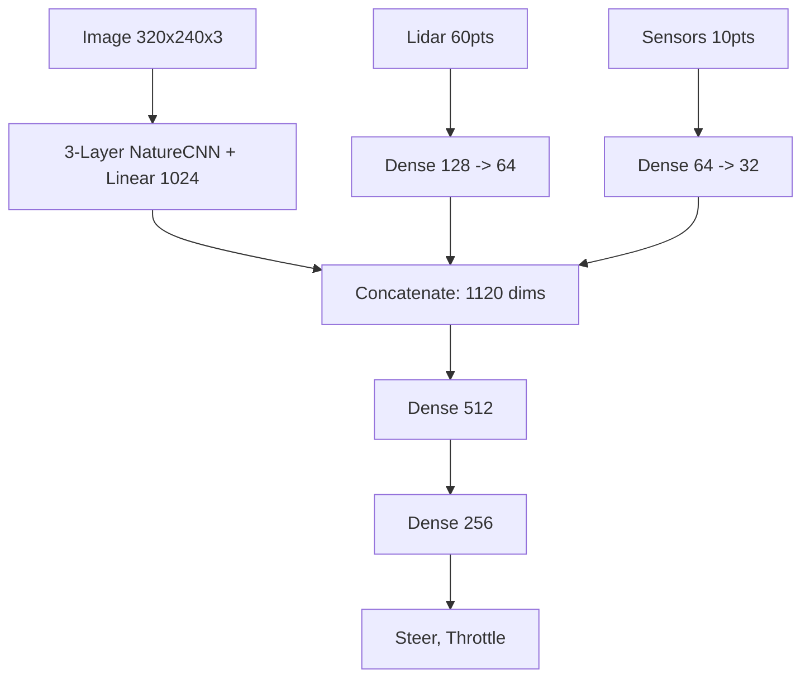

# 🏎️ Monaco Autonomous Racing: Master Technical Knowledge Base

This is the consolidated technical manual for the Monaco autonomous racing ecosystem. It synthesizes architectural designs, multi-agent historical data, telemetry protocols, and critical bug fixes into a single source of truth.

---

## 1. 📂 Core Repository Architecture

The project follows a three-stage evolutionary pipeline to achieve sub-22s lap times:

| Phase | Method | Primary Responsibility | Core Files |
| :--- | :--- | :--- | :--- |
| **I. Mapping** | GraphSLAM & B-Splines | Lidar localization & Apex racing line | `01_MAPPING/run_slam_mapping.py`, `01_MAPPING/monaco_mapper.py` |
| **II. Expert (BC)** | Behavioral Cloning | Neural telemetry mimicry | `03_BC_EXPERT/train_bc_monaco.py`, `monaco_engines.py` |
| **III. Optimization** | RL (PPO) | Surpassing human lines via SB3 weight injection | `04_RL_PPO/run_ppo.py`, `04_RL_PPO/reward_config.json` |
| **GUI Control** | CustomTkinter | Unified command center for mapping, BC, and RL | `monaco_dashboard.py`, `monaco_engines.py` |

---

## 2. 🗺️ SLAM & Path Planning

### 2.1 SLAM Discovery & Anchor Alignment
- **Sensor**: 360-degree Lidar scan from Unity simulator.
- **Keyframe Optimization**: New poses are recorded only when displacement > 0.5m or rotation > 0.2 rad.
- **Anchor Alignment**: `monaco_slam_anchor.npy` contains a high-resolution scan at the start line. Upon reset, the agent aligns its initial scan to this anchor to eliminate spawn rotation drift.
- **Lidar Coordinate Mirroring**: `calibrate_monaco.py` established `LIDAR_MIRROR = -1` and `YAW_OFFSET = 45°` to resolve counter-clockwise vs clockwise indexing mismatches between Unity Lidar scans and SLAM orientation.

### 2.2 Apex Line Generation (A* + Splines)
- **Inflation Strategy**: Grid walls are expanded by 0.2m (4 pixels at 0.05m resolution) using `cv2.erode` to guarantee a safe buffer from barriers.
- **B-Spline Smoothing**: Raw A* paths contain sharp turns. `scipy.interpolate.splprep` with `s=2.0` generates a 1200-point smooth trajectory that maximizes cornering speed and momentum preservation.

---

## 3. 🧠 Behavioral Cloning (BC) Architecture

### 3.1 Telemetry Protocol (V70 Master Sync)
All sensor inputs are normalized before being fed to the neural network:
- **Vision**: 320x240 RGB frames, normalized in the initial CNN layer.
- **Lidar**: 60-beam scan, divided by `50.0`.
- **Speed**: Telemetry speed divided by `20.0`.
- **IMU Sensors**: Acceleration divided by `10.0`, Gyroscope divided by `5.0`.
- **GPS Coordinates**: Position scaled by `8.0 / 100.0`.

### 3.2 Unified Neural Network Topology
To ensure 100% tensor transfer between Behavioral Cloning and PPO Reinforcement Learning, both use the identical multi-head architecture:



---

## 4. ⚡ Reinforcement Learning (PPO) & Weight Transfer

### 4.1 Expert Weight Injection
Instead of training PPO from random initialization (which requires millions of steps), PPO is hot-started by injecting pre-trained weights from BC:

| BC Model Layer | PPO Policy Layer Target | Status |
| :--- | :--- | :--- |
| `cnn.` | `features_extractor.image_cnn.` | Synchronized |
| `cnn_fc.` | `features_extractor.image_linear.` | Synchronized |
| `lidar_fc.` | `features_extractor.lidar_fc.` | Synchronized |
| `sensor_fc.` | `features_extractor.sensors_fc.` | Synchronized |
| `policy_head.0.` | `mlp_extractor.policy_net.0.` | Synchronized |
| `policy_head.2.` | `mlp_extractor.policy_net.2.` | Synchronized |
| `policy_head.4.` | `action_net.` | Synchronized |

### 4.2 Active Reward Shaping (`04_RL_PPO/reward_config.json`)
The active reward function combines speed, progress, and smoothness:

```json
{
    "speed_weight": 2.0,
    "cte_penalty_weight": 2.0,
    "precision_bonus": 0.1,
    "jitter_penalty_weight": 0.5,
    "terminal_penalty": -200.0,
    "safe_zone": 1.5,
    "reload_freq": 1000,
    "lap_bonus_base": 150.0,
    "time_penalty": -0.05
}
```

---

## 5. ⚠️ Troubleshooting & Pitfalls Database

> [!WARNING]
> **1. The Double Normalization Bug (Blind Car)**
> - **Symptom**: Car drives straight into walls or turns randomly; loss drops but performance is zero.
> - **Root Cause**: Dividing image arrays by `255.0` manually in wrappers when Stable Baselines3's `NatureCNN` already normalizes internally. Input values end up near `0.0` (black).
> - **Fix**: Retain normalization strictly inside the network layer; do not double-divide in data loaders.

> [!CRITICAL]
> **2. Zero Weight Tensor Injection Bug**
> - **Symptom**: PPO prints success message but starts training with random weights.
> - **Root Cause**: Discrepancy in layer names (`conv.` vs `cnn.`) between different BC script versions.
> - **Fix**: Added explicit `RuntimeError` in `run_ppo.py` if `injected_count == 0`, halting execution if weight transfer fails.

> [!IMPORTANT]
> **3. The Finish Line / Unity Telemetry Hang**
> - **Symptom**: Car completes a lap and Python execution freezes indefinitely.
> - **Root Cause**: Unity pauses camera rendering for split-time UI after crossing the finish line.
> - **Fix**: 100ms Watchdog in `donkey_sim.py` socket loop that forces a step return and triggers an environment reset.

> [!CAUTION]
> **4. Steering Jitter & Action Space Oscillation**
> - **Symptom**: Rapid left-right steering oscillation at high speeds.
> - **Root Cause**: Raw un-smoothed action outputs directly applied to simulator steering.
> - **Fix**: Enforced `DonkeySmoothActionWrapper` with Exponential Moving Average (`alpha=0.5`).

> [!NOTE]
> **5. Data Leakage in BC Validation**
> - **Symptom**: Validation loss is artificially low, but car fails in actual driving.
> - **Root Cause**: Random `random_split` of sequential driving frames puts adjacent frames (milliseconds apart) in both train and validation splits.
> - **Fix**: Use chronological sequential splits (`Subset` by time range) for validation.

> [!WARNING]
> **6. VRAM Deadlock (Unreleased PyTorch Tensors)**
> - **Symptom**: RL training hangs during `model.learn()` after a few thousand timesteps.
> - **Root Cause**: Unreleased PyTorch GPU tensors in observation wrappers consuming GPU memory in rollout buffers.
> - **Fix**: Convert image arrays to CPU `.byte()` format before storing them in rollout buffers.

---

## 6. 🏁 Environment & Execution Setup

- **Python Environment**: Managed local `.venv` (Python 3.12).
- **Simulator Executable**: Specified dynamically via `DONKEY_SIM_PATH` environment variable or local relative lookup `DonkeySimWin2/donkey_sim.exe`.
- **Launching Dashboard**:
  ```powershell
  .\run_gui.ps1
  ```
